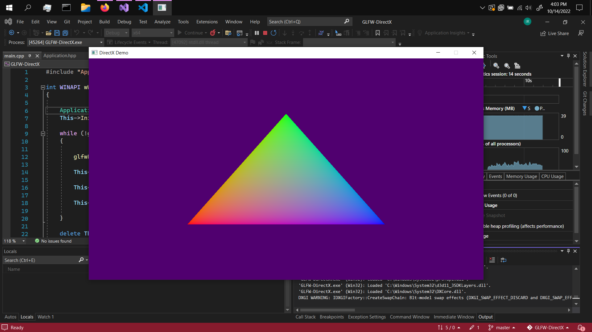

# GLFW-DirectX

## Requirements
* Windows machine
* [Visual Studio 2022](https://visualstudio.microsoft.com/)
* [Python](https://www.python.org/)


## Dependencies
* [GLFW](https://www.glfw.org/)

<br>

# Getting Started
The dependency already comes with the repository as precompiled binaries, it's a .dll file, a python script should take care of putting it in the output directory when the project is built. Before running the project, you have to set the working directory to ```$(OutDir)``` in the project settings because Visual Studio won't let Git track this setting.


<br>

# DirectX Rendering in GLFW
It's possible to use DirectX with GLFW using [**glfw3native.h**](https://www.glfw.org/docs/3.3/glfw3native_8h.html)
that comes with the library. GLFW is supposed to be a cross-platform library, but DirectX being a Microsoft only technology will only work on Windows or an Xbox.


##### C++ macros can be used so that an application can select whatever rendering API to use on whatever platform it's targeting, so it should be possible to build a cross-platform application despite using platform intrinsic technology.

<br> <br>

## Retrieving the [HWND](https://learn.microsoft.com/en-us/windows/win32/learnwin32/what-is-a-window-)

Getting the Handle to the win32 window is just a simple [function](https://www.glfw.org/docs/3.3/group__native.html#gafe5079aa79038b0079fc09d5f0a8e667)
call which can be exposed by including **glfw3native.h** and defining a macro to expose the win32 api.

```cpp
//macro must be defined before including glfw3native.h
#define GLFW_EXPOSE_NATIVE_WIN32

#include <GLFW/glfw3.h>
#include <GLFW/glfw3native.h>
```

<br>

After including the header file, retrieving the window handle is as simple as:
```cpp
HWND WindowHandle = glfwGetWin32Window(GLFWWindow);
```
The window handle will be used to create the DXGI swap chain and Direct3D [Device and Device Context](https://learn.microsoft.com/en-us/windows/win32/direct3d11/overviews-direct3d-11-devices-intro)


<br>

## Framework for learning DirectX
I think GLFW is a good library to use for learning DirectX, it's fairly simple to use and it abstracts all the boilerplate code that's required to setup on win32. Like registering a window class, setting up a window procedure to handle window messages, mouse and keyboard input. GLFW will take care of all that, letting users to focus on just learning Direct3D.


<br>

## Screenshot :



<br> <br>

## Resources

* [ChiliTomatoNoodle](https://www.youtube.com/playlist?list=PLqCJpWy5Fohd3S7ICFXwUomYW0Wv67pDD)
* [Direct3D11 MSDN](https://learn.microsoft.com/en-us/windows/win32/direct3d11/atoc-dx-graphics-direct3d-11)
